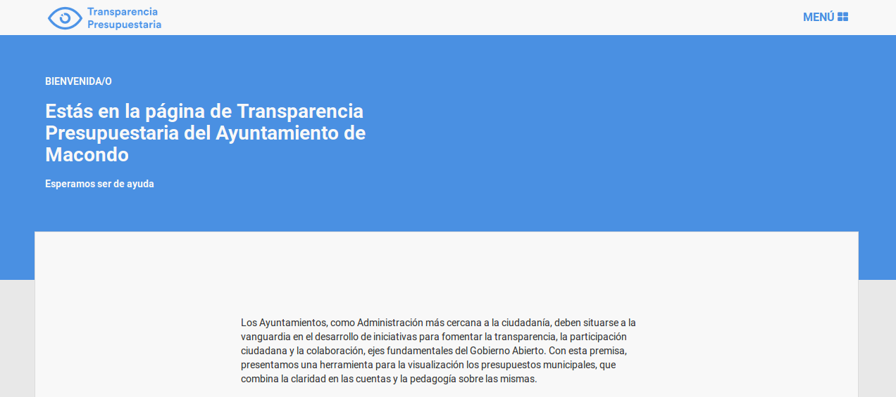
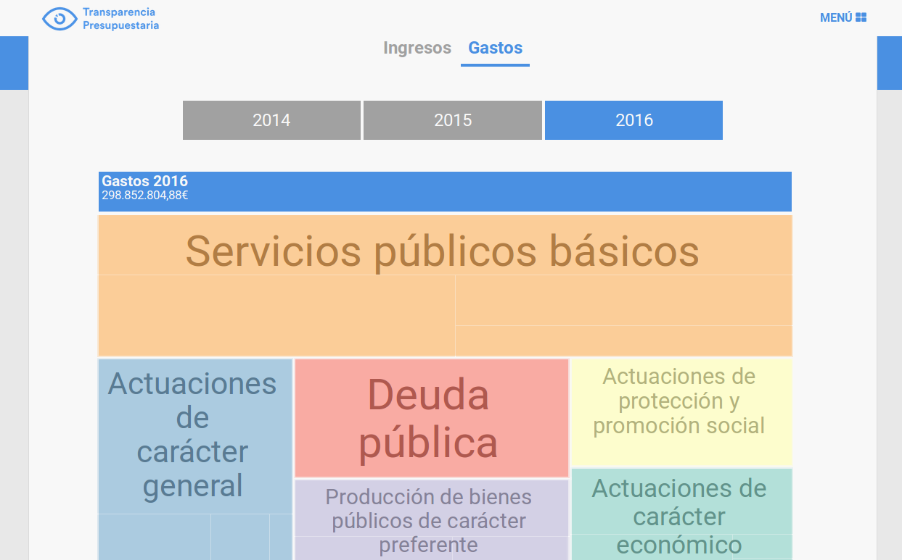
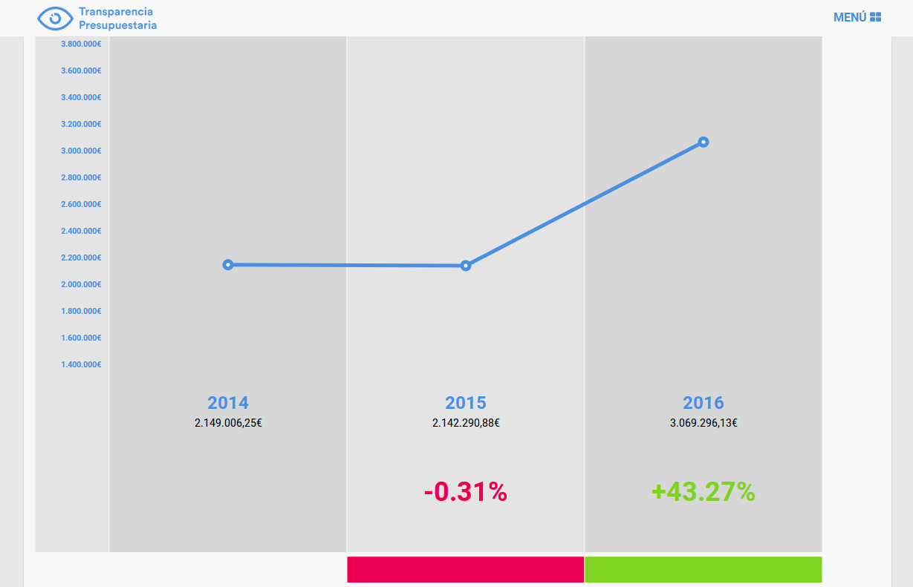

Transparencia Presupuestaria
=======

Herramienta para la construcción de sitios web de Transparencia Presupuestaria

## Interfaces

### Página de inicio



### Visualización del presupuesto



### Comparativa entre partidas



## Requisitos

Tener instalado nodejs y npm en tu máquina.

##Carga el entorno

Clona este repositorio y luego ejecuta dentro de su carpeta lo siguiente:

```
npm install -g grunt-cli
npm install

```

##Ejecución (para desarrollo)

```
grunt
```

##Compilación (para despliegue)

```
grunt build
```

##Carga de datos

Accede a la carpeta ./src/budgets y una vez allí ejecuta el comando

```
python parse.py -i budget.csv -t expenses -y 2016
```

donde:

* *Budget.csv* es el presupuesto que se quiere cargar (hay un ejemplo del tipo de plantilla en ./budget_template.csv)
* *expenses* es el tipo de presupuesto (hacer lo mismo con incomes)
* *2016* es el año que se quiere cargar (hacer lo mismo para los dos años anteriores)

Para más información ejecuta

```
python parse.py --help
```
